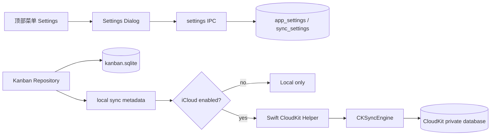

# 本地优先 iCloud 同步可实施方案

日期：2026-05-12

## 目标

实现一个本地优先的同步能力：应用默认继续只使用本地 SQLite；顶部菜单提供 Settings 入口；Settings 中允许用户开启或关闭 iCloud 同步。开启同步后，本地数据库仍是唯一活跃读写源，CloudKit 只作为后台记录级同步通道。关闭同步后，所有看板功能不受影响。

## 不做什么

- 不把 SQLite 文件放入 iCloud Drive。
- 不默认开启 iCloud。
- 不在用户未确认时把本地数据上传到新的 iCloud 账号。
- 第一版不做多人共享。
- 第一版不要求 iPhone/iPad 版同时完成。
- 第一版不把整个 Electron 数据层迁到 Swift/Core Data。

## 方案选择

| 方案 | 内容 | 工作量 | 风险 | 结论 |
| --- | --- | --- | --- | --- |
| A. 首个可用版交付 Settings + 最小 CloudKit helper 闭环 | Settings 入口、持久化配置、Swift helper、CKSyncEngine 最小同步一起交付 | 高 | 涉及 Electron、SQLite、Swift、签名和 CloudKit，调试面大 | 推荐，符合用户要求 |
| B. Settings + 本地配置先落地，CloudKit helper 后续接入 | 先做设置入口、持久化配置、同步状态模型；随后接 Swift helper/CKSyncEngine | 中 | 分阶段期间 Settings 可能先显示“本地模式/未配置” | 不采用，用户明确不接受 |
| C. 改为 SwiftUI/Core Data + NSPersistentCloudKitContainer | 用 Apple 官方自动镜像能力重写 Apple 端 | 高 | 当前 Electron 复用困难，迁移成本大 | 暂不采用 |

推荐方案 A。它符合本地优先诉求，也满足“第一版开启 iCloud 后必须可用”的要求。回滚策略仍然清晰：任何同步问题都可以把 `iCloudEnabled` 置为 false，应用继续读写本地 SQLite。

## 核心设计



### 本地优先规则

- 所有 UI 查询和写入都只走本地 repository。
- `iCloudEnabled = false` 时，不启动 CloudKit helper，不上传，不拉取，不弹 iCloud 登录流程。
- `iCloudEnabled = true` 时，写入仍先落 SQLite，再由同步层异步发送。
- 同步失败只改变同步状态，不阻断本地编辑。
- 关闭同步不会删除本地数据，也不会删除 CloudKit 数据。
- 切换 iCloud 账号时默认暂停同步，要求用户选择后再继续。

## Settings 入口与 UI

### 入口

现有 macOS 应用菜单已经在 `packages/main/src/index.ts` 的 `configureApplicationMenu` 中配置。第一版新增：

- `Kanban > Settings...`，快捷键 `Cmd+,`。
- 点击菜单项后，主进程通过 `mainWindow.webContents.send(...)` 通知 renderer 打开 Settings。
- renderer 暴露一个只读事件订阅 API，例如 `app.onOpenSettings(callback)`。

为了满足“顶部下拉菜单”的可见入口，同时避免只依赖 macOS 系统菜单，renderer 标题栏右侧新增一个紧凑的 settings/overflow 图标按钮：

- 图标按钮放在 `App.tsx` 的 titlebar 右侧安全区。
- 点击打开小型下拉菜单。
- 菜单项包含 `Settings`。
- macOS 应用菜单和 renderer 顶部下拉都打开同一个 Settings dialog。

决策：第一版同时做 macOS 应用菜单和 renderer 顶部下拉入口。

### Settings Dialog 内容

第一版只放必要控制：

- iCloud Sync toggle：默认 off。
- Sync status：`Local only`、`Checking iCloud`、`Syncing`、`Up to date`、`Paused`、`Error`。
- Last synced at。
- Manual action：`Sync Now`，仅在开启 iCloud 且 helper 可用时启用。
- Account state：`Unavailable`、`Signed out`、`Signed in`、`Changed account`。

第一版不允许出现“开关保存成功但 helper 未接入导致长期 unavailable”的半成品状态。`Unavailable` 只表示运行环境异常，例如非 macOS、签名缺 entitlement、iCloud 服务不可达或 helper 启动失败。

不要在设置页里写大段解释。复杂说明放到文档或帮助入口；界面只给状态和可执行动作。

## IPC 与类型调整

新增 shared 类型：

- `AppSettings`。
- `SyncSettings`。
- `SyncStatus`。
- `ICloudAccountStatus`。

新增 IPC namespace：

- `settings.getSettings()`。
- `settings.updateSettings(patch)`。
- `sync.getStatus()`。
- `sync.syncNow()`。
- `app.onOpenSettings(callback)`，这是 main 到 renderer 的事件通道，不是 invoke。

涉及文件预计超过 8 个，并且会新增同步服务边界：

- `packages/shared/src/ipc-channels.ts`
- `packages/shared/src/ipc-contract.ts`
- `packages/shared/src/types/settings.ts`
- `packages/main/src/ipc/register.ts`
- `packages/main/src/ipc/contract-binder.ts`
- `packages/preload/src/api.ts`
- `packages/preload/src/index.ts`
- `packages/renderer/src/global.d.ts`
- `packages/renderer/src/App.tsx`
- `packages/renderer/src/components/settings-dialog.tsx`
- `packages/main/src/db/schema.ts`
- `packages/main/src/db/repositories/settings-repository.ts`
- `packages/main/src/sync/sync-service.ts`
- `packages/main/src/sync/cloudkit-helper-client.ts`
- Swift helper / XPC target 及其 entitlement 配置文件

## 本地数据库调整

先新增设置表，和业务同步元数据分开：

```sql
CREATE TABLE IF NOT EXISTS app_settings (
  key TEXT PRIMARY KEY,
  value_json TEXT NOT NULL,
  updated_at INTEGER NOT NULL
);
```

设置 key：

- `sync.icloud.enabled`：boolean。
- `sync.icloud.lastRequestedAt`：number。
- `sync.icloud.lastDisabledAt`：number。

同步元数据表在第二阶段加入：

```sql
CREATE TABLE IF NOT EXISTS sync_state (
  key TEXT PRIMARY KEY,
  value BLOB NOT NULL,
  updated_at INTEGER NOT NULL
);

CREATE TABLE IF NOT EXISTS sync_outbox (
  id TEXT PRIMARY KEY,
  entity_type TEXT NOT NULL,
  entity_id TEXT NOT NULL,
  operation TEXT NOT NULL,
  changed_fields_json TEXT,
  created_at INTEGER NOT NULL,
  device_id TEXT NOT NULL,
  attempts INTEGER NOT NULL DEFAULT 0,
  last_error TEXT
);
```

第一版可用同步要求同步元数据和业务表迁移一起完成。可以暂时只同步 Board、Column、Card、Label、CardLabel，但这几类实体必须具备 tombstone、CloudKit metadata 和 outbox 能力。

## 分阶段实施

### 阶段 1：Settings 入口与同步配置

目标：用户可以从顶部菜单打开 Settings，并配置“是否使用 iCloud 同步”。此阶段可以独立开发，但不能作为可发布版本单独交付。

改动：

1. 在主进程菜单加入 `Settings...` 和 `Cmd+,`。
2. 增加 main -> renderer 事件通道 `app:open-settings`。
3. 增加 preload 订阅 API，返回 unsubscribe。
4. 增加 `app_settings` 表和 `SettingsRepository`。
5. 增加 settings IPC。
6. 新增 `SettingsDialog`，包含 iCloud Sync toggle。
7. 标题栏右侧新增 settings/overflow 下拉入口。

验收：

- `Cmd+,` 能打开 Settings。
- 顶部下拉菜单能打开 Settings。
- 开关状态重启后保持。
- 关闭 iCloud 时 Kanban 创建、编辑、拖拽不受影响。
- `pnpm run typecheck` 通过。
- `pnpm test` 通过或明确列出失败原因。

### 阶段 2：本地同步状态与业务元数据

目标：为首个可用同步版本准备本地状态、outbox、tombstone 和最小记录级元数据。

改动：

1. 增加 `SyncService` 接口：`getStatus`、`setEnabled`、`syncNow`。
2. `iCloudEnabled = false` 时状态为 `Local only`。
3. 增加 `sync_state`，保存 device id、CloudKit state serialization 和本地 sync capability version。
4. 给 board/column/card/label/card_label 增加 tombstone 或同步 ID 能力。
5. 把 hard delete 改为 tombstone delete；真正清理延后做。
6. 增加 `sync_outbox`，本地写入时记录待同步实体。
7. 保留 `subtasks_json`、`comments_json` 作为 Card 字段，明确 MVP 期间它们不是独立记录级合并。

验收：

- 删除 board/card 后本地列表行为不变。
- export/import 不误导地导出 tombstone。
- repository tests 覆盖删除、恢复、outbox 写入。

### 阶段 3：Swift CloudKit helper / CKSyncEngine

目标：在 macOS 上接入系统 iCloud 登录态和 CloudKit private database。此阶段完成后才算第一版 iCloud 同步可用。

改动：

1. 新增 Swift helper/XPC target，配置 iCloud + CloudKit + remote notifications entitlement。
2. helper 初始化 `CKSyncEngine`，持久化 state serialization。
3. helper 提供本地 IPC：account status、start/stop、sync now、pending change notify。
4. Electron main 仍是 SQLite 单写入者；helper 拉到远端变更后，通过 IPC 请求 main 执行本地 transaction。
5. CloudKit schema v1 只同步 Board、Column、Card、Label、CardLabel。
6. 初次开启 iCloud 时，如果云端已有数据，默认 merge，不提供覆盖本地选项。

验收：

- 未登录 iCloud 时 Settings 显示 Signed out，本地可用。
- 开启 iCloud 后能创建 custom zone。
- 两个本地数据目录模拟两台设备，手动 send/fetch 后数据收敛。
- 网络失败只更新 sync status，不阻断本地编辑。

### 阶段 4：首个可用版发布门槛

目标：把 Settings 和最小 CloudKit 同步闭环作为一个可发布版本验收。

签名前提：CloudKit helper 必须使用具备 `iCloud.com.magenta9.kanban` CloudKit entitlement 的 Apple 证书和 provisioning profile 签名。electron-builder 的 ad-hoc 签名可以验证打包结构，但不能实际运行带 iCloud entitlement 的 helper；ad-hoc 包中 Settings 应显示不可用或 helper 错误，不能视为 iCloud 验收通过。

发布门槛：

- Settings 中开启 iCloud 后，真实启动 helper，并能完成 account check。
- 已登录 iCloud 且网络可用时，能创建 CloudKit custom zone。
- 本地新增 board/column/card 能上传到 CloudKit。
- 第二个本地 profile 或第二台设备能拉取到数据。
- 云端已有数据时默认 merge 到本地，不覆盖本地。
- 关闭 iCloud 后，继续本地编辑，且不继续上传。
- helper 不存在或启动失败时，不能把功能标记为可用；Settings 必须显示明确错误，并保留本地模式。
- `pnpm run typecheck` 通过。
- `pnpm test` 通过或明确列出失败原因。

### 阶段 5：真正记录级细化

目标：把容易冲突的 JSON 字段拆成独立实体，实现可靠多端合并。

改动：

1. 新增 `kanban_subtasks`。
2. 新增 `kanban_comments`。
3. `CardLabel` 使用稳定同步 ID 和 tombstone。
4. Card placement 使用独立 `placementUpdatedAt`。
5. 引入 `field_versions_json` 或等价字段级版本表。

验收：

- 两台设备同时编辑卡片 title 和移动卡片，最终都保留。
- 两台设备同时新增 comment/subtask，最终都保留。
- 删除和远端编辑冲突时 delete-wins，并能在最近删除中恢复。

## 开启/关闭 iCloud 的行为

### 初次开启

1. 保存 `sync.icloud.enabled = true`。
2. 检查平台、helper、entitlement 和 iCloud account。
3. 如果 helper 不可用或运行环境不满足要求，开启失败，保留 `sync.icloud.enabled = false`，Settings 显示明确错误。
4. 如果 helper 可用，先 fetch remote changes。
5. 如果云端为空，上传本地 active records。
6. 如果云端已有数据，执行 merge，不直接覆盖本地。

决策：云端已有数据时默认 merge，不提供“覆盖本地”作为第一版选项。

### 关闭

1. 保存 `sync.icloud.enabled = false`。
2. 停止自动同步和手动 sync now。
3. 保留 `sync_state` 和 `ck_record_metadata`，方便以后重新开启。
4. 不删除 CloudKit 数据。
5. 本地写入继续更新 `updated_at`，重新开启时通过扫描 `updated_at > last_synced_at` 或全量校验补齐 outbox。

### 账号切换

1. 检测到 account change 后设置状态为 `Paused`。
2. 不自动上传本地数据到新账号。
3. Settings 提供明确操作：`Merge local data into this iCloud account` 或 `Use this iCloud account data`。
4. 第一版可以只实现暂停和提示，不实现账号切换合并。

## 风险检查

- 依赖失败：CloudKit、iCloud 登录、helper、远程通知都可能不可用。降级策略是本地模式继续可用，Settings 显示状态。
- 数据规模：单用户看板数据量不大，SQLite 和 CloudKit record 足够；真正先出问题的是 `subtasks_json/comments_json` 的整字段冲突，所以阶段 5 必须拆表。
- 回滚成本：阶段 1 和 2 可直接隐藏 Settings 中的 iCloud 区块；阶段 3 以后要保留 migration，但可以关闭同步，不影响本地读写。
- 脆弱前提：Electron main 作为 SQLite 单写入者必须成立。如果 helper 也直接写 SQLite，要重新设计锁和迁移策略。

## 测试计划

- 单元测试：`SettingsRepository` 默认值、读写、损坏 JSON 回退。
- IPC 测试：settings channel 注册完整，preload API 类型匹配。
- UI 测试：Settings dialog 打开/关闭、toggle 保存、状态展示。
- repository 测试：tombstone delete、outbox 写入、恢复行为。
- 同步集成测试：两个本地 DB 模拟两台设备，覆盖创建、修改、删除、冲突。
- 真机测试：remote notification 和后台自动同步必须用真实 Mac/iPhone 验证。

## 建议提交切片

1. `feat(settings): add app settings storage and ipc`
2. `feat(ui): add settings menu and dialog`
3. `feat(sync): add local sync status and metadata migrations`
4. `feat(sync): add cloudkit helper integration`
5. `feat(sync): complete first usable icloud sync flow`
6. `refactor(kanban): split subtasks and comments for record sync`

## 需要用户确认的决策

已确认：

1. Settings 第一版同时做 macOS 应用菜单和 renderer 顶部下拉入口。
2. 初次开启 iCloud 时，如果云端已有数据，默认 merge。
3. 第一版不接受“iCloud toggle 可保存，但 helper 未接入时显示 unavailable”；首个可用版必须接入 helper 并完成最小 CloudKit 同步闭环。