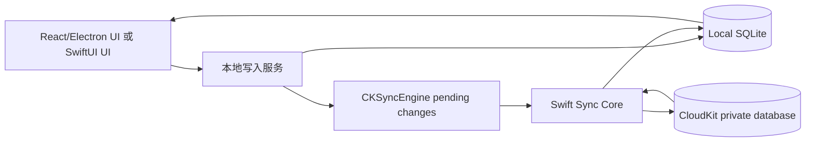

# Apple-only 记录级同步实现调研

日期：2026-05-12

## 结论

如果继续保留当前 Electron + SQLite 桌面应用，同时要做 iPhone/iPad 版，Apple-only 记录级同步建议走 **CloudKit private database + custom record zone + CKSyncEngine**。本地 SQLite 仍然是活跃数据库，CloudKit 只同步业务记录和 tombstone，不同步 SQLite 文件。

`NSPersistentCloudKitContainer` 是纯原生 Apple App 的更省代码方案，但它更适合把数据模型迁到 Core Data，由 Core Data 拥有 CloudKit schema。它不适合当前 Electron 直接复用现有 SQLite schema，也不适合作为 Electron 与 iOS 共用同一套记录协议的主路径。

推荐判断：

| 路线 | 适合 | 不适合 | 对当前项目的判断 |
| --- | --- | --- | --- |
| CloudKit + CKSyncEngine + 自定义记录协议 | Electron 继续存在、iOS/iPadOS 原生、需要共享 CloudKit schema、需要自定义冲突策略 | 想极少写同步代码 | 推荐 |
| NSPersistentCloudKitContainer | 纯 SwiftUI/Core Data App、Apple-only、愿意接受 Core Data schema | Electron 直接复用、跨运行时共享 SQLite schema | 可作为重写原生版方案，不作为当前主同步方案 |
| 手写 CloudKit operation/change token/subscription | 需要支持 iOS 16 或更老系统、极端自定义 | iOS 17+/macOS 14+ 项目 | 不优先，CKSyncEngine 已覆盖调度和增量同步骨架 |

## 关键约束

- CloudKit 是记录同步服务，不替代本地数据对象。官方建议把 CloudKit record metadata 附着到本地 model/cache，再用 metadata 重建 `CKRecord`。
- custom record zone 只支持 private database。Apple-only 私有多设备同步应使用 `CKContainer.default().privateCloudDatabase` 或指定 container 的 private database。
- `CKSyncEngine` 管同步调度、订阅、增量拉取、部分系统级重试，但不替应用做本地 outbox、record hydrate、冲突合并、账号切换策略。
- `CKSyncEngine` 的调度是系统驱动的，受 iCloud 登录、网络、电量、系统负载影响。需要立即同步时再调用 `fetchChanges` 或 `sendChanges`。
- `CKSyncEngine` 需要持久化 opaque state serialization，否则下次启动无法正确增量同步。
- 远程通知不能当成具体变更内容，只能当成“有变化”的信号；收到通知后仍要 fetch changes。

## 推荐架构

### 运行时结构



桌面端有两种集成方式：

1. **Swift helper/XPC 负责 CloudKit 同步，Electron main 继续负责业务 IPC 和 UI。** helper 读取同一个 SQLite 文件或通过本地 IPC 请求 Electron main 提供待同步记录。优点是 CloudKit entitlement、remote notification、CKSyncEngine 都在原生层；缺点是打包、签名、DB 并发和进程通信要认真处理。
2. **把 Kanban 数据服务迁到 Swift service，Electron 只当 UI 壳。** 这是长期更干净的桌面架构，但迁移成本高。

iPhone/iPad 端建议把同步核心做成 Swift package：`KanbanSyncCore`。它包含 CloudKit record 映射、CKSyncEngine delegate、冲突合并、SQLite/DAO 适配接口。SwiftUI App 只调用本地 repository，不直接操作 CloudKit。

## CloudKit 数据建模

### Container / database / zone

- Container：例如 `iCloud.<team-or-bundle>.kanban`，真实 ID 由 Apple Developer/Xcode capability 决定。
- Database：private database。
- Zone：MVP 使用单个 custom zone，例如 `KanbanPrivateV1`。

单 zone 的优点是实现简单，所有实体的增量变化从一个 zone 拉取即可。缺点是未来如果要 board 级共享，可能需要迁移到“每个 board 一个 zone”。当前只关注 Apple-only 私有同步，单 zone 足够。

### Record type

建议 CloudKit record type 与业务实体对齐：

| Record type | recordName | 关键字段 |
| --- | --- | --- |
| `Board` | board UUID | `name`, `description`, `createdAt`, `updatedAt`, `archivedAt`, `deletedAt` |
| `Column` | column UUID | `boardId`, `name`, `color`, `position`, `createdAt`, `updatedAt`, `archivedAt`, `deletedAt` |
| `Card` | card UUID | `boardId`, `columnId`, `title`, `descriptionJson`, `descriptionText`, `priority`, `dueDate`, `position`, `createdAt`, `updatedAt`, `archivedAt`, `deletedAt` |
| `Label` | label UUID | `boardId`, `name`, `color`, `createdAt`, `updatedAt`, `deletedAt` |
| `CardLabel` | `${cardId}_${labelId}` | `boardId`, `cardId`, `labelId`, `createdAt`, `deletedAt` |
| `Subtask` | subtask UUID | `boardId`, `cardId`, `title`, `completed`, `position`, `createdAt`, `updatedAt`, `deletedAt` |
| `Comment` | comment UUID | `boardId`, `cardId`, `body`, `createdAt`, `updatedAt`, `deletedAt` |

当前项目把 subtasks/comments 放在 `kanban_cards.subtasks_json` 和 `comments_json`。如果要真正记录级合并，应该拆成独立表和独立 CloudKit record。否则两台设备同时改不同 subtask/comment 时，会变成整张卡的 JSON 字段冲突。

关系字段建议先用稳定 ID 字符串，例如 `boardId`、`columnId`、`cardId`、`labelId`。可以额外存 `CKRecord.Reference` 方便 CloudKit Dashboard 观察关系，但不要把业务合并逻辑依赖在 CloudKit 的引用级联上。

### 字段类型

- UUID：String。
- 时间：CloudKit 用 `Date`，本地 SQLite 可继续用 epoch milliseconds，转换层负责互转。
- position：建议中期从 `REAL sort_order` 迁移到 LexoRank 类字符串。`REAL` 现在能用，但多设备频繁插入同一位置时更容易需要重排。
- rich text JSON：小体量可存 String/Data；如果未来描述里有附件，附件用 `CKAsset`，正文只存引用或元数据。
- tombstone：用 `deletedAt` 字段表达业务删除，不要一开始就物理删除 CloudKit record。

## 本地 SQLite 需要新增的同步元数据

每个可同步实体表建议新增：

- `deleted_at INTEGER`：业务删除 tombstone。当前有 `archived_at`，但归档不是删除，不能替代 tombstone。
- `created_by_device_id TEXT`。
- `updated_by_device_id TEXT`。
- `field_versions_json TEXT`：可选，但推荐给 `Card` 使用，记录字段级更新时间和设备 ID。
- `ck_record_metadata BLOB`：`CKRecord.encodeSystemFields` 后的二进制数据，用于保存 record ID、zone ID、change tag 等系统字段。
- `last_synced_at INTEGER`：便于调试和 UI 展示。

全局同步表：

```sql
CREATE TABLE sync_state (
  key TEXT PRIMARY KEY,
  value BLOB NOT NULL,
  updated_at INTEGER NOT NULL
);

CREATE TABLE sync_outbox (
  id TEXT PRIMARY KEY,
  entity_type TEXT NOT NULL,
  entity_id TEXT NOT NULL,
  operation TEXT NOT NULL CHECK (operation IN ('save', 'delete')),
  changed_fields_json TEXT,
  created_at INTEGER NOT NULL,
  device_id TEXT NOT NULL,
  attempts INTEGER NOT NULL DEFAULT 0,
  last_error TEXT
);
```

`sync_state` 至少保存：

- `cksyncengine_state_serialization`。
- `device_id`。
- `last_account_identifier`，如果能安全获取。
- schema/local migration version。

`sync_outbox` 与 `CKSyncEngine.state.pendingRecordZoneChanges` 有重叠。推荐保留 outbox 作为本地可观测事实来源，再把 outbox 中的记录镜像到 CKSyncEngine pending changes。这样 UI 可以展示“待同步/失败”，也方便测试和重放。

## 同步流程

### 1. 初始化

1. 读取本地 SQLite、`device_id`、`cksyncengine_state_serialization`。
2. 创建 `CKSyncEngine.Configuration(database: privateCloudDatabase, stateSerialization: savedState, delegate: syncCore)`。
3. 设置 `automaticallySync = true`。
4. 首次启动或遇到 `.zoneNotFound` 时，向 engine state 添加 `.saveZone(CKRecordZone(zoneName: "KanbanPrivateV1"))`。
5. 如果 UI 有“立即同步”，调用 `fetchChanges` 和 `sendChanges`，但常规同步交给系统调度。

### 2. 本地写入

每次用户操作都先写本地 SQLite：

1. 在 SQLite transaction 内更新业务表。
2. 设置 `updated_at`、`updated_by_device_id`，删除时写 `deleted_at`。
3. 写入 `sync_outbox`。
4. 原生 App 直接调用 `syncEngine.state.add(pendingRecordZoneChanges: [.saveRecord(recordID)])`；Electron 桌面端则通过本地 IPC 通知 Swift helper 添加 pending change。
5. 对真实 CloudKit record deletion 这种少数场景，才添加 `.deleteRecord(recordID)`。

删除策略：业务实体默认保存 tombstone record，而不是立即调用 CloudKit delete。原因是 CloudKit 删除事件只告诉其他设备 record ID，不携带业务字段；tombstone 能支持 delete-wins、恢复入口、调试和延迟清理。

### 3. CKSyncEngine 请求待上传 batch

在 delegate 的 `nextRecordZoneChangeBatch` 中：

1. 从 `syncEngine.state.pendingRecordZoneChanges` 按 scope 取待处理 record IDs。
2. 对每个 record ID 从 SQLite 读取实体。
3. 如果本地有 `ck_record_metadata`，先解码成 `CKRecord`；否则创建新的 `CKRecord(recordType:..., recordID:...)`。
4. 把本地字段填充到 record。
5. 如果本地记录不存在但有 tombstone，生成带 `deletedAt` 的 tombstone record；如果连 tombstone 都没有，移除这条 pending change。
6. 返回 `CKSyncEngine.RecordZoneChangeBatch`。

### 4. 上传结果处理

在 `sentRecordZoneChanges` 事件中：

- `savedRecords`：把 server 返回的 `CKRecord` system fields 编码回 `ck_record_metadata`，清理 outbox，更新 `last_synced_at`。
- `.serverRecordChanged`：取 error 里的 server record，与本地记录执行应用级 merge；保存 server metadata；如果 merge 后本地仍有应上传的结果，再添加 `.saveRecord(recordID)`。
- `.zoneNotFound`：添加 `.saveZone(zone)`，清空相关实体的 `ck_record_metadata`，重新添加 `.saveRecord(recordID)`。
- `.unknownItem`：如果本地是活跃记录，清空 metadata 后按新记录重传；如果本地是删除 tombstone，可视为删除已在服务端完成。
- 网络、限流、服务不可用等 transient errors：让 CKSyncEngine 按系统策略重试，应用只记录状态。

### 5. 拉取远端变化

在 `fetchedRecordZoneChanges` 事件中：

1. 对 modifications 按 record type 分发到对应 apply 函数。
2. 如果 record 有 `deletedAt`，按 delete-wins 处理本地 tombstone。
3. 如果是普通修改，执行字段级 merge。
4. 保存 record system fields 到 `ck_record_metadata`。
5. 对 deletions，如果使用了真实 CloudKit delete，本地写 tombstone 或物理删除已过期 tombstone。
6. 在一个 SQLite transaction 中应用一批远端变化，避免 UI 看到半更新状态。

### 6. 账号变化

CKSyncEngine 会发 `accountChange`。这部分不能静默处理成“自动上传到新账号”。推荐产品策略：

- sign out：暂停云同步，本地数据保留，UI 显示“未连接 iCloud”。
- sign in 同一账号：恢复同步，必要时重新 fetch。
- switch accounts：暂停同步，要求用户明确选择“保留本地并上传到新 iCloud”或“切换为新 iCloud 数据”。默认不要把旧账号本地数据上传到新账号。

Apple 示例为了简化会在某些账号变化下删除或重传本地数据，但正式产品应把这个选择暴露给用户。

## 冲突策略

不要使用 CloudKit server `modificationDate` 作为业务冲突的唯一依据。保存到服务器的先后顺序不等于用户编辑意图。应使用应用写入的 `updatedAt` / 字段级版本。

推荐策略：

| 数据 | 策略 |
| --- | --- |
| board name/description | 字段级 last-write-wins，比较字段级 `updatedAt` |
| column name/color | 字段级 last-write-wins |
| column position | 独立比较 `positionUpdatedAt`，不要覆盖 name/color |
| card title/description/priority/dueDate | 字段级 last-write-wins |
| card move | 把 `columnId + position` 当成独立 placement 字段，比较 `placementUpdatedAt` |
| labels | `Label` 独立记录，`CardLabel` 集合合并，删除靠 tombstone |
| comments | append-only，按 comment ID 合并；编辑 comment 才比较 comment.updatedAt |
| subtasks | 独立 record，按 subtask ID 合并；completed/title/position 分字段处理 |
| delete | delete-wins，但保留 tombstone 和最近删除/恢复入口 |

字段级版本可以先存在 `field_versions_json`，例如：

```json
{
  "title": { "updatedAt": 1788888888000, "deviceId": "device-a" },
  "description": { "updatedAt": 1788888890000, "deviceId": "device-b" },
  "placement": { "updatedAt": 1788888895000, "deviceId": "device-a" }
}
```

如果两个字段版本时间完全相同，用 `deviceId` 或 `changeId` 做稳定 tie-breaker，保证所有设备收敛到同一结果。

## 当前项目的落地步骤

### 第 -1 步：Apple 能力配置

- Apple Developer Program 账号。
- Xcode capability 开启 iCloud，并选择 CloudKit service。
- 配置 `com.apple.developer.icloud-services = CloudKit`。
- 配置 `com.apple.developer.icloud-container-identifiers`。
- CKSyncEngine 依赖 remote notifications，macOS/iOS target 需要相应通知能力和后台执行配置。
- 开发与生产 CloudKit schema 分开管理；production schema 发布后只能做 additive changes。

### 第 0 步：先定 Apple 同步边界

需要确认桌面端是“Electron 继续拥有 SQLite”还是“迁移到 Swift service 拥有数据层”。如果不确认这个边界，helper 与 Electron main 都可能写同一个 SQLite，后续会出现锁、迁移和通知一致性问题。

保守建议：先让 Electron main 继续拥有现有 repository；新增 Swift helper 只负责 CloudKit 账号、CKSyncEngine、record push/pull。helper 要应用远端变更时，通过本地 IPC 请求 Electron main 执行 SQLite transaction。这样 DB 单写入者清晰，但 IPC 协议会更厚。

### 第 1 步：同步元数据迁移

- 给现有表加 `deleted_at`、device id、CloudKit metadata。
- 新增 `sync_state`、`sync_outbox`。
- 把硬删除改成 tombstone 删除，至少 board/card/label/card_label 要先改。

### 第 2 步：CloudKit schema v1

- 创建 CloudKit container 和 `KanbanPrivateV1` custom zone。
- 先同步 `Board`、`Column`、`Card` 三类记录。
- `subtasks_json`、`comments_json` 短期可继续作为 Card 字段，但明确这是 MVP 限制。

### 第 3 步：CKSyncEngine delegate

- 实现初始化、state serialization 持久化。
- 实现 `nextRecordZoneChangeBatch`。
- 实现 fetched/sent/accountChange 事件处理。
- 实现 `syncNow`、`syncStatus`、`pauseSync` 给 UI 使用。

### 第 4 步：拆分子任务/评论/标签关系

- 新增 `kanban_subtasks`、`kanban_comments`，从 JSON 迁移。
- `kanban_card_labels` 增加可同步 ID 或使用 `${cardId}_${labelId}` 作为同步 ID，并支持 tombstone。
- 完成真正记录级合并。

### 第 5 步：iPhone/iPad

- SwiftUI App 使用同一套 `KanbanSyncCore`。
- 本地持久化可以用 SQLite/GRDB 以贴近现有 schema，也可以迁移 Core Data，但不要再混用 `NSPersistentCloudKitContainer` 自动镜像同一个 CloudKit schema。
- 移动端所有 UI 读写都走本地 repository，同步异步发生。

## 测试策略

- 使用独立开发 CloudKit container 或测试 zone，避免污染真实用户数据。
- 仿照 Apple CKSyncEngine sample，用两个本地数据库实例模拟两台设备，手动调用 `sendChanges` / `fetchChanges`。
- 覆盖：首次全量同步、重命名、卡片移动、同时编辑不同字段、同时移动同一张卡、删除后另一端编辑、zoneNotFound、unknownItem、serverRecordChanged、账号切换。
- 真机测试远程通知。Apple 示例明确提到 simulator 不能注册 remote push notifications，因此 simulator 可以测手动 fetch/send，不能证明自动后台同步体验。
- UI 层测试只验证状态展示：未登录 iCloud、待同步、同步中、失败待重试、最近同步时间。

## 风险与开放问题

- 当前 Electron/Node 不能直接调用 CloudKit。没有 Swift helper/XPC 或 native addon，就无法做系统 iCloud 登录态下的 CKSyncEngine。
- CloudKit production schema 一旦部署，不能删除字段或 record type，只能做 additive changes。v1 schema 要小心命名。
- 单 zone 简单，但未来 board 级共享可能要迁移到 board-per-zone。
- `REAL sort_order` 可以先保留，但多端插入冲突会逼近重排逻辑。中期建议换 LexoRank 类 position。
- 是否保留本地数据跨 iCloud 账号切换是产品策略，不是纯技术问题。默认不应静默上传到新账号。

## 官方/权威来源

- CloudKit：https://developer.apple.com/documentation/cloudkit
- CKSyncEngine：https://developer.apple.com/documentation/cloudkit/cksyncengine-5sie5
- Local Records：https://developer.apple.com/documentation/cloudkit/local-records
- Remote Records：https://developer.apple.com/documentation/cloudkit/remote-records
- Designing and Creating a CloudKit Database：https://developer.apple.com/documentation/cloudkit/designing-and-creating-a-cloudkit-database
- NSPersistentCloudKitContainer：https://developer.apple.com/documentation/coredata/nspersistentcloudkitcontainer
- Mirroring a Core Data store with CloudKit：https://developer.apple.com/documentation/coredata/mirroring-a-core-data-store-with-cloudkit
- iCloud Services Entitlement：https://developer.apple.com/documentation/bundleresources/entitlements/com.apple.developer.icloud-services
- iCloud Container Identifiers Entitlement：https://developer.apple.com/documentation/bundleresources/entitlements/com.apple.developer.icloud-container-identifiers
- Apple sample-cloudkit-sync-engine：https://github.com/apple/sample-cloudkit-sync-engine